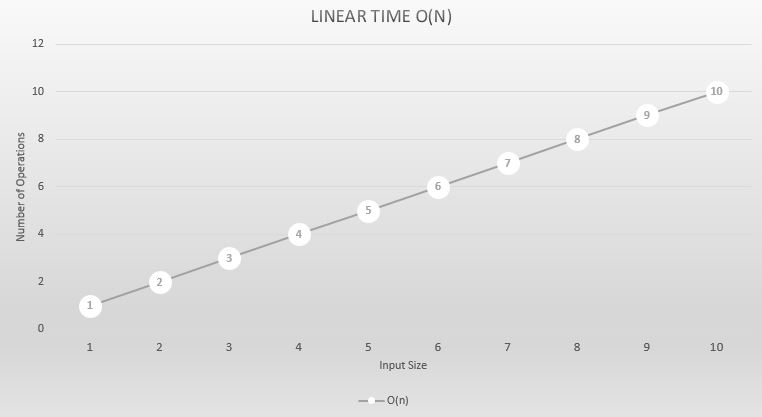

Let us look a the below extension method which generates an Enumerable of size n and copies the value to n items in the Enumerable.

```csharp
public static IEnumerable<T> GetEnumerablePrePopulated<T>(this T value, long n)
{
    List<T> result = new List<T>();
    for (int i = 0; i < n; i++)
    {
        result.Add(value);
    }
    return result;
}
```

Let's count the number of steps in this particular method.

```csharp
List<T> result = new List<T>();
// One Step = O(1)
// In general we do not count this but we will act as if we do for now.

for (int i = 0; i < n; i++)
// n Steps = O(n)
{
    result.Add(value);
}

return result;
// One Step = O(1)
```

We can say the overall time it take to execute the above method is O(1 + n + 1) = O(n + 2). Since we are looking at the scalability of an algorithm and n becomes very high the constants in this case 2 have no impact on the overall execution time as we looked at in the previous sections. Hence we will conclude that the function is O(n) time complexity. Let's visualize Constant time by looking at the below chart.



[Next >> Quadratic Time O(n^2) Example](./QuadraticTime.md)

[Previous << Constant Time O(1) Example](./ConstantTime.md)

[Index](Index.md)
