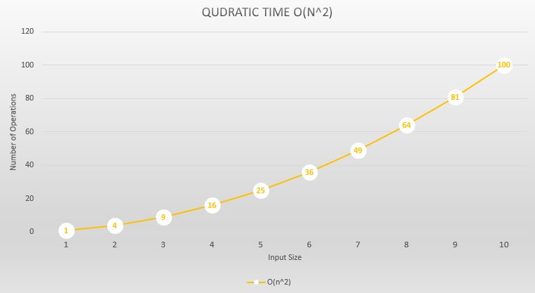

Let us look a the below method which just print the input which we have take a look at in previous sections.

```csharp
internal static void Print(IEnumerable<string> input)
{
    int i = 1, j = 1;
    foreach(var item in input)
    {
        Console.WriteLine($"1.{i++} {item}");
        foreach (var item in input)
        {
            Console.WriteLine($"2.{j++} {item}");
        }
    }
}
```

Lets count the number of steps in this particular method.

```csharp
internal static void Print(IEnumerable<string> input)
{
    int i = 1, j = 1;
    //O(2)
    foreach(var item in input)
    //O(n)
    {
        Console.WriteLine($"1.{i++} {item}"); //O(1)
        foreach (var item in input)
        //O(n)
        {
            Console.WriteLine($"2.{j++} {item}"); //O(1)
        }
    }
}
```

We can say the overall time it take to execute the above method is `O(2+n+1*n+n*n+1*n) = O(2 + 3n + n^2) = O(n^2)`. Since we are looking at the scalability of an algorithm and n becomes very high the constants in this case 2 have no impact on the overall execution time. Hence we will conclude that the function is O(n^2) time complexity. Let's visualize Constant time by looking at the below chart.



[Previous << Linear Time O(n) Example](./LinearTime.md)

[Index](./Index.md)
