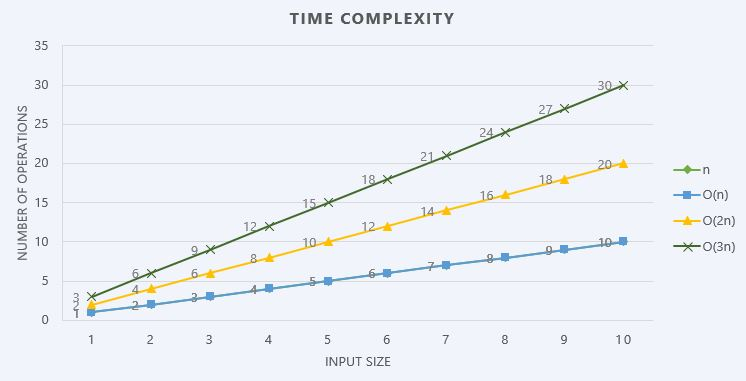
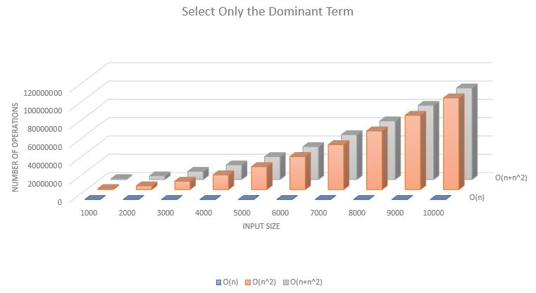
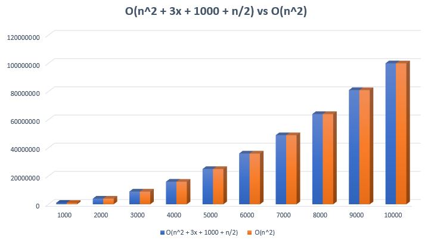

# Steps to Derive Time Complexity - Take 2

We can look at deriving time complexity using the following four rules as well just to make sure we understand how this works. Let us look at the four rules.

## Rule 1: Consider Only The Worst-Case Scenario

Always consider the worst-case scenario for an algorithm. Let us take an example to understand this, let us take a simple sort algorithm that will loop through each element in the list to find out if an element is present.

Lets first look at the best case i.e., the element being searched is in the first index.

```csharp
var names = new string[] { "findme", "tom",
       "linda", "jack", "giant", "sam" };
var itemsToFind = "findme";
var stepsTaken = 0;
for (int i = 0; i < names.Length; i++)
{
    stepsTaken++;
    if (names[i].Equals(itemsToFind,
        StringComparison.InvariantCultureIgnoreCase))
    {
        Console.WriteLine($"Found Item at index {i}");
        break;
    }
}
Console.WriteLine($"Steps taken {stepsTaken}");

/*
Output
------
Found Item at index 0
Steps taken 1
*/
```

It only takes 1 step to find the string in the array as you see from the example. You may say the time complexity if the item being searched is in the first place, but Big O looks at the scalability of an algorithm it does not care about what the best case is. Let's look at the same example now the worst case.

```csharp
var names = new string[] { "sam", "tom",
       "linda", "jack", "giant", "findme" };
var itemsToFind = "findme";
var stepsTaken = 0;
for (int i = 0; i < names.Length; i++)
{
    stepsTaken++;
    if (names[i].Equals(itemsToFind,
        StringComparison.InvariantCultureIgnoreCase))
    {
        Console.WriteLine($"Found Item at index {i}");
        break;
    }
}
Console.WriteLine($"Steps taken {stepsTaken}");

/*
Output
------
Found Item at index 5
Steps taken 6
*/
```

It takes 6 steps to find the item if its in the last index of the array i.e., to say O(n) in the above example n = 6. But ideally, we would pass in the array as an argument which essentially means n is a variable hence the worst case for this algorithm is O(n) where n is the input size.

## Rule 2: Remove Constants

Looking at the same example, let's look at the complexity of each line of the algorithm.

```csharp
var names = new string[] { "sam", "tom",
       "linda", "jack", "giant", "findme" };
// For the above assignment the complexity is O(1)
var itemsToFind = "findme";
// For the above assignment the complexity is O(1)
var stepsTaken = 0;
// For the above assignment the complexity is O(1)
for (int i = 0; i < names.Length; i++)
{
    stepsTaken++;
    // For the above operation the complexity is O(1)
    if (names[i].Equals(itemsToFind,
        StringComparison.InvariantCultureIgnoreCase))
    // For the above operation the complexity is O(1)
    {
        Console.WriteLine($"Found Item at index {i}");
        break;
        // We will ignore these two since it has no effect like O(1) anyways
    }
    // The overall complexity of the step in the
    // for loop is O(1 + 1 + 1)/O(1)+O(1)+O(1)
    // Lets consider that to be O(3) for now
    // The overall complexity of the for loop
    // as a whole is hence n*O(3)/O(n*3)
    // Which is O(3n)
}
Console.WriteLine($"Steps taken {stepsTaken}");
// For the above operation the complexity is O(1)
```

Lets add everything up so the complexity turns out to be O(1) + O(1) + O(1) (from assignments above for loop) + O(3n) (of the for loop) + O(1) (of the write line). Simplifying O(1 + 1 + 1 + 3n + 1) = O(4 + 3n). As n grows bigger and bigger the constant 4 and three in the expression will have close to no impact on the overall performance of the algorithm. Hence we ignore all the constants in this case and conclude the complexity to be O(n) for this particular algorithm.

T1 = O(10 + n/2 + 100001) = O(n)
T2 = O(10 + 3n + 10000) = O(n)
T3 = O(2n) = O(n)

If we plot say O(3n), O(2n) and O(n) on a chart the chart for O(3n) will be steeper than O(2n) will be steeper than O(n), but still all three increases in a linear fashion. Since we are only worried about how the function is scaling that is to say Linear time/Constant time etc. we don't really need to worry above 3, 2 in 3n, 2n since all three O(n), O(2n) and O(3n) is linear time we do not care about the slope of the function. Take a look at the chart below which can give you a bit more clarity, the slopes of three functions are different but they are all linear.



## Rule 3: Different terms for input

Let's look at what the complexity of the below algorithm is, its O(2n) for two for loops = O(n) dropping the constants.

```csharp
internal static void Print(IEnumerable<string> input)
{
    int i = 1, j = 1;
    foreach(var item in input)
    {
        Console.WriteLine($"1.{i++} {item}");
    }

    foreach (var item in input)
    {
        Console.WriteLine($"2.{j++} {item}");
    }
}
```

Say we have two different input parameters one for each of them for a loop. Now we have two potentially different input sizes say n for input1 and m for input2. Hence the complexity of this cannot be simplified to O(n). It should be O(n + m) since we have two different input sizes.

```csharp
internal static void Print(IEnumerable<string> input1,
                            IEnumerable<string> input2)
{
    int i = 1, j = 1;
    foreach(var item in input1)
    {
        Console.WriteLine($"1.{i++} {item}");
    }

    foreach (var item in input2)
    {
        Console.WriteLine($"2.{j++} {item}");
    }
}
```

What if they are nested as in the for loops like below?

```csharp
internal static void Print(IEnumerable<string> input1,
                            IEnumerable<string> input2)
{
    int i = 1, j = 1;
    foreach(var item in input1)
    {
        Console.WriteLine($"1.{i++} {item}");
        foreach (var item in input2)
        {
            Console.WriteLine($"2.{j++} {item}");
        }
    }
}
```

Let us say the number of elements in input1 is n and input2 is m. The inner loop one operating on input2 will be executed for each element in input1 m times i.e., this algorithm is of the order O(n\*m).

Say both loops are operating on the same input, the size of the input will be obviously the same say n. Hence for the below example, the complexity is O(n\*n) = O(n^2).

```csharp
internal static void Print(IEnumerable<string> input)
{
    int i = 1, j = 1;
    foreach(var item in input)
    {
        Console.WriteLine($"1.{i++} {item}");
        foreach (var item in input)
        {
            Console.WriteLine($"2.{j++} {item}");
        }
    }
}
```

## Rule 4: Drop non Dominants

This rule simply says that we only need to consider the most dominant term while determining the complexity of an algorithm. Say we have an algorithm with the complexity of O(n + n^2), as n grows significantly n^2 outgrows n, n has close to no impact on the operations required to perform the task. Let's chart this and look at how it pans out.



As you see as the input size increases n has no impact on the overall performance/number of operations, hence we can drop n of the equation. A final example shows how constants and non-dominant terms can be dropped.

Consider O(n^2 + 3x + 1000 + n/2) vs O(n^2), clearly need I say more.



[Next >> Constant Time O(1) Example](./ConstantTime.md)

[Previous << Steps to Derive Time Complexity - Take 1](./StepstoDeriveTimeComplexity.md)

[Index](./README.md)
